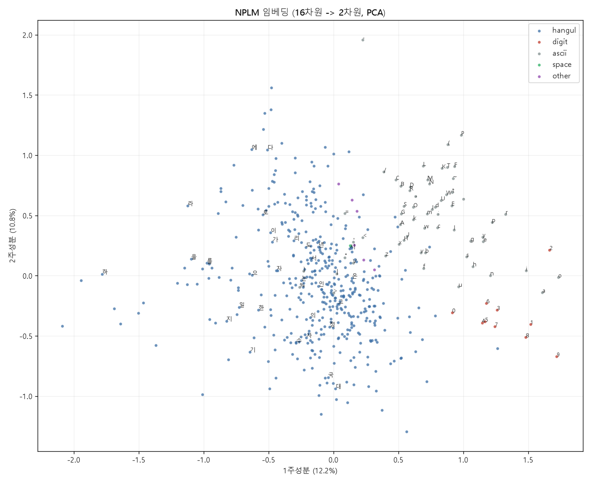
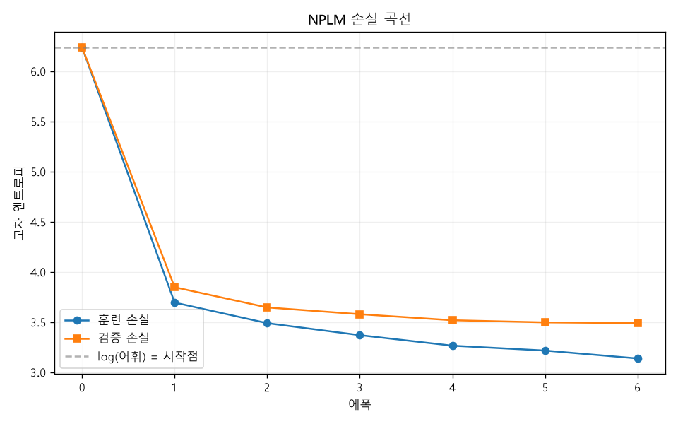

# C6. 결과 분석

> **선행** · C++ 교재 `6.3` 파일 스트림 · C3 (훈련), C4 (`.npy`)
> **만드는 것** · `lib/Pca`, `tools/plot_embedding.py`
> **예제** · C6-1 ~ C6-4

---

## 0. 16차원을 보는 방법

C3에서 글자마다 16개의 숫자를 얻었다. 숫자로는 이웃을 확인했다.

```
  '1'     → 2(0.820) 3(0.766) 5(0.740) 4(0.733) 7(0.705)
```

그런데 **전체가 어떻게 생겼는지**는 이런 목록으로 알 수 없다. 512개 점이 16차원 공간 어디에 놓여 있는지를 보려면 눌러서 그려야 한다.



**첫 번째 주성분이 문자 체계를 가른다.** 왼쪽이 한글, 가운데-오른쪽이 라틴 문자, 맨 오른쪽이 숫자다.

아무도 "한글과 숫자를 구분하라"고 가르친 적이 없다. 그냥 **다음 글자를 맞히라고 시켰을 뿐**인데, 그걸 잘하려면 문자 체계를 구분하는 것이 도움이 되기 때문에 스스로 그렇게 배웠다.

---

## 1. 역할을 나눈다

이 장은 **C++과 파이썬이 각자 무엇을 하는지**를 정하는 장이기도 하다.

| 하는 일 | 누가 | 왜 |
|---|---|---|
| 훈련 | C++ | 계산이 무겁다. C5에서 본 대로 |
| 숫자 뽑기 | C++ | 모델이 여기 있다 |
| 형식 맞춰 내보내기 | C++ | C4의 `.npy` |
| **그림 그리기** | **파이썬** | matplotlib 한 줄이면 되는 일 |
| PCA | **양쪽 다** | 서로 검산하려고 |

A파트 초입에 "파이썬은 데이터 준비와 시각화에만"이라고 정했다. 여기서 실물이 된다.

그리고 **경계를 파일 형식이 지킨다.** C4에서 만든 `.npy` 리더가 계약서다. C++이 쓰고 파이썬이 읽는데, 둘 다 같은 바이트를 본다.

```
[C6-2] 임베딩을 .npy 로 내보낸다

  data/embedding.npy  (512 x 16)
  data/vocab.csv  (512줄)
```

`.npy` 에는 숫자만 들어간다. **어느 줄이 어느 글자인지**는 `vocab.csv` 가 따로 알려준다. 사람이 읽어야 하는 것은 CSV, 프로그램이 읽는 것은 이진 — C4에서 정한 규칙 그대로다.

---

## 2. PCA를 직접 만든다

주성분 분석이 하는 일은 한 줄로 말할 수 있다.

> **데이터가 가장 넓게 퍼져 있는 방향**을 찾아, 그 방향으로 재어 적는다.

16차원에서 방향 두 개를 고르면 2차원 그림이 된다. 고르는 기준은 "누르고 나서 남는 정보가 가장 많은 방향"이다.

### 평균을 먼저 뺀다

```cpp
Mean[d] /= (double)N;
...
Covariance[i*D + j] += (Data(n,i) - Mean[i]) * (Data(n,j) - Mean[j]);
```

안 빼면 **"원점에서 얼마나 먼가"** 를 첫 주성분이 차지한다. 우리가 알고 싶은 것은 서로 얼마나 **다른가**이지 원점과 얼마나 먼가가 아니다.

### 거듭제곱법

고유값 분해 라이브러리를 안 쓴다. 차원이 16이라 직접 하는 편이 짧고, 무엇을 하는지도 보인다.

```cpp
for (Round)
{
    Next = Covariance * V;     // 행렬을 곱하고
    V = Next / |Next|;         // 길이를 1 로 되돌린다
}
```

아무 벡터에나 행렬을 계속 곱하면 **가장 큰 고유값 쪽으로 쏠린다.** 다른 성분들이 상대적으로 작아지기 때문이다. 길이를 매번 1로 되돌리지 않으면 값이 넘치거나 사라진다.

두 번째 방향은 **디플레이션**으로 얻는다.

```cpp
Covariance -= Value * V * V^T;   // 방금 찾은 방향의 몫을 지운다
```

지우고 나서 다시 거듭제곱법을 돌리면 그 다음으로 큰 방향이 나온다.

### 부호를 못박는다

여기가 함정이다. **고유벡터는 `v` 든 `-v` 든 똑같이 답이다.**

그대로 두면 돌릴 때마다, 언어마다 방향이 뒤집힌다. 그림이 좌우 반전되고, 두 구현을 비교할 수가 없다.

```cpp
// 절대값이 가장 큰 성분을 양수로 만든다
if (V[Biggest] < 0.0) { for (i) V[i] = -V[i]; }
```

파이썬 쪽도 **같은 규칙**을 쓴다.

```python
def FixSign(Vector):
    Biggest = int(np.argmax(np.abs(Vector)))
    return -Vector if Vector[Biggest] < 0 else Vector
```

**답이 여러 개인 계산에서는 하나를 고르는 규칙을 정해야 한다.** A2에서 정렬의 2순위를 못박은 것과 같은 이야기다.

### 검사

```
  1주성분의 길이 = 0.999999995 (1 이어야 한다)
  2주성분의 길이 = 0.999999996
  둘의 내적      = -0.000000005 (0 이어야 한다)
```

주성분은 **길이가 1이고 서로 직각**이어야 한다. 이게 안 맞으면 거듭제곱법이 수렴 안 했거나 디플레이션이 틀린 것이다.

```cpp
CHECK_NEAR(std::sqrt(LengthOne), 1.0, 1e-5);
CHECK_NEAR(Dot, 0.0, 1e-4);
```

---

## 3. 파이썬이 검산한다

NumPy에는 `np.linalg.eigh` 가 있다. 대칭 행렬의 고유값 분해를 제대로 된 알고리듬(QR 반복)으로 한다. 우리 거듭제곱법과 **완전히 다른 방법**이다.

```python
Values, Vectors = np.linalg.eigh(Covariance)
Order = np.argsort(Values)[::-1]
```

결과를 맞춰보면,

```
PCA 검산
  설명 분산   1주성분 12.23%, 2주성분까지 23.03%
  좌표 최대 차이 = 6.205e-08  (좌표 크기 2.087)
  상대 오차      = 2.973e-08
  판정           = 일치
```

**상대 오차 3e-08.** `float` 로 저장한 임베딩을 읽어 계산한 것이라 이 정도면 완전 일치다.

이 검사가 잡아주는 것.

- 거듭제곱법이 **엉뚱한 고유벡터**로 수렴했는가
- 디플레이션이 틀렸는가
- 평균 빼기를 빼먹었는가
- 부호 규칙이 양쪽에서 다른가

C3에서 NumPy로 그래디언트를 검산한 것과 같은 자리다. **다른 방법으로 같은 답이 나오면 둘 다 맞을 확률이 크게 올라간다.**

---

## 4. 그림이 말해주는 것

```
  표본 509개, 16차원 -> 2차원
  1주성분이 설명하는 분산 = 12.23%
  2주성분까지 = 23.03%
```

**23%밖에 못 담는다.** 16차원을 2차원으로 눌렀으니 당연하다. 나머지 77%는 그림에 없다.

그래서 그림은 **증거가 아니라 단서**다. 뭉쳐 보이는 것이 진짜 가까운지는 원래 차원에서 재야 한다.

```
[C6-4] 2차원으로 눌러도 이웃이 남는가

  무리                16차원       2차원
  숫자끼리           0.8101      0.9792
  한글끼리           0.0148      0.0450
```

**숫자끼리는 16차원에서도 0.81, 눌러도 0.98이다.** 그림에서 오른쪽 구석에 빨간 점들이 뭉쳐 있는 것이 진짜다.

**한글끼리는 0.0148이다.** 거의 무관하다. 한글 글자 509개 중 대부분이 서로 다른 역할을 하므로 당연하다 — `을`과 `를`은 가깝지만 `을`과 `꽃`은 아니다.

그림에서 파란 점이 넓게 퍼져 있는 것이 그 숫자와 맞는다. **뭉쳐 있는 것은 뭉친 것이고, 퍼져 있는 것은 퍼진 것이다.**

> 2차원 수치가 16차원보다 큰 것에 주의할 것. 차원을 줄이면 **우연히 가까워 보이는 것**이 늘어난다. 2차원에 512개 점을 뿌리면 서로 가까울 수밖에 없다. **낮은 차원의 유사도를 그대로 믿으면 안 된다.**

### 첫 주성분이 무엇을 골랐는가

그림의 가로축을 보면 왼쪽부터 한글 → 라틴 문자 → 숫자 순이다. 모델이 배운 것 중 **가장 크게 갈리는 성질이 문자 체계**라는 뜻이다.

말이 된다. 한국어 텍스트에서 한글 다음에 오는 것과 숫자 다음에 오는 것은 완전히 다르다. `1` 다음에는 숫자·`년`·`월`이 오고, `가` 다음에는 조사와 어미가 온다. **다음 글자를 맞히는 데 가장 유용한 구분**이 문자 체계였던 것이다.

세로축(2주성분)은 덜 분명하다. 한글 안에서 `에`, `다`, `라` 가 위쪽에, `국`, `대` 가 아래쪽에 있다. 조사·어미와 명사 조각이 갈리는 것으로 보이지만, 확신하려면 더 봐야 한다. **그림에서 읽어낸 것은 가설이지 결론이 아니다.**

---

## 5. 손실 곡선



```
      에폭     훈련 손실     검증 손실
        0        6.2379        6.2367
        1        3.6936        3.8466
        ...
        6        3.1366        3.4887
```

점선이 `log(512) = 6.238` 이다. C1에서 세운 "시작 손실은 `log(어휘)`" 규칙이 그림에서도 확인된다.

두 곡선이 **벌어지는 것**이 보인다. 훈련 손실은 3.14, 검증 손실은 3.49. C3에서 본 과적합이다.

> **그림으로 봐야 보이는 것이 있다.** 표로 보면 숫자가 내려간다는 것만 알지만, 그림으로 보면 **두 곡선이 언제부터 벌어지기 시작했는지**가 한눈에 들어온다. 이게 시각화를 따로 두는 이유다.

---

## 정리

만든 것.

| 파일 | 내용 |
|---|---|
| `lib/Pca.hpp` · `.cpp` | 거듭제곱법 + 디플레이션. 부호 규칙 포함 |
| `tools/plot_embedding.py` | NumPy 검산 + matplotlib 그림 |
| `data/embedding.npy` | 훈련한 임베딩 512×16 |
| `data/embedding.png`, `loss_curve.png` | 그림 |

준비물이 하나 늘었다.

```bash
.venv/Scripts/python -m pip install matplotlib
```

알아둘 것.

- **역할을 나눈다.** 계산은 C++, 그림은 파이썬. 경계는 파일 형식이 지킨다
- **PCA는 평균을 먼저 뺀다.** 안 빼면 첫 주성분이 "원점에서의 거리"가 된다
- **거듭제곱법은 열 줄이다.** 차원이 작으면 라이브러리보다 직접이 낫다
- **답이 여러 개면 하나를 고르는 규칙을 정한다.** 고유벡터의 부호
- **주성분은 길이 1, 서로 직각.** 이 검사가 수렴을 확인해준다
- **낮은 차원의 유사도를 그대로 믿으면 안 된다.** 우연히 가까워 보인다
- **23%만 담긴 그림은 단서지 증거가 아니다**

쓴 문법.

- `FILE*` 로 CSV 쓰기 — C 교재 `11.1`
- 람다를 지역 함수처럼 쓰기 (`auto MeanSimilarity = [&](...)`)
- B3의 `CosineSimilarity` 재사용

---

## 연습문제

**1.** PCA에서 평균 빼기를 지우면 그림이 어떻게 되는가?

<details>
<summary>해답</summary>

**첫 주성분이 "평균 방향"이 되고, 거의 모든 점이 한쪽에 몰린다.**

평균을 안 빼면 공분산 행렬이 아니라 **2차 적률 행렬**을 계산하게 된다. 그 행렬의 가장 큰 고유벡터는 데이터의 평균 방향에 가깝다. 모든 점이 그 방향으로 비슷한 크기의 성분을 갖고 있으니, 투영하면 다들 비슷한 값이 나온다.

그림으로는 **가로로 길게 늘어선 띠** 하나가 보이고, 그 안에서 구분이 안 된다. 설명 분산 비율은 오히려 **올라간다** — 첫 주성분이 "다들 갖고 있는 공통분"을 담기 때문이다. 숫자만 보면 좋아진 것처럼 보인다.

**설명 분산이 높다고 좋은 PCA가 아니다.** 이런 함정이 실제로 자주 나온다.

우리 임베딩은 평균이 0 근처라(초기화가 `RandomRange(±0.1)` 이고 그래디언트가 양쪽으로 온다) 차이가 극적이지는 않을 것이다. 데이터에 따라서는 완전히 못 쓰게 된다.

</details>

**2.** `lib/Pca` 의 `Iterations` 를 200에서 5로 줄이면?

<details>
<summary>해답</summary>

**직각 검사부터 깨진다.**

```cpp
CHECK_NEAR(Dot, 0.0, 1e-4);
```

거듭제곱법이 덜 수렴하면 첫 번째 벡터가 진짜 고유벡터가 아니다. 그 벡터로 디플레이션을 하면 **덜 지워지고**, 두 번째 벡터가 첫 번째 성분을 조금 갖게 된다. 그러면 둘의 내적이 0이 아니다.

수렴 속도는 **고유값의 비율**에 달려 있다. 첫 번째와 두 번째 고유값의 비가 `λ1/λ2` 이면, 한 번 돌 때마다 오차가 그 비율만큼 줄어든다. 우리 데이터는 12.23% 대 10.80% 라 비가 1.13밖에 안 된다 — **아주 느리게 수렴한다.** 그래서 200번이 필요했다.

이게 거듭제곱법의 약점이다. 고유값이 비슷하면 오래 걸리고, **정확히 같으면 영원히 수렴 안 한다.**

제대로 하려면 QR 알고리듬을 쓴다. NumPy의 `eigh` 가 그것이고, 고유값이 비슷해도 잘 돈다. 대신 구현이 200줄이 넘는다.

**작은 문제에는 단순한 방법, 큰 문제에는 라이브러리** — 이것도 판단이다. 여기서는 16×16이라 200번 돌려도 눈 깜짝할 새다.

</details>

**3.** 임베딩을 2차원 대신 3차원으로 누르면 얼마나 더 담기는가?

<details>
<summary>해답</summary>

**조금 더 담기고, 그림이 어려워진다.**

1주성분 12.23%, 2주성분까지 23.03%. 3주성분까지는 대략 32% 언저리일 것이다(고유값이 완만하게 줄어드는 모양이다).

여기서 중요한 것은 **왜 이렇게 고르게 퍼져 있는가**다. 16차원에 정보가 12%, 11%, 9%... 식으로 흩어져 있다는 것은, **어느 한 방향이 지배적이지 않다**는 뜻이다.

좋은 신호다. 만약 첫 주성분이 90%를 차지했다면 16차원이 사실상 1차원이라는 뜻이고, **차원을 낭비하고 있다**는 말이 된다. C3 연습문제 3에서 "임베딩 차원을 늘려도 계속 좋아지지는 않는다"고 한 것의 다른 얼굴이다.

3차원 그림은 그릴 수 있지만 **읽기 어렵다.** 회전해가며 봐야 하고, 정지 화면에서는 앞뒤가 헷갈린다. 그래서 실무에서는 2차원을 쓰되 **PCA 대신 t-SNE나 UMAP**을 쓰는 경우가 많다. 이들은 "가까운 것을 가깝게"에 집중해서 뭉치를 더 잘 드러낸다.

다만 대가가 있다. t-SNE의 그림에서 **덩어리 사이의 거리는 의미가 없다.** PCA는 선형 변환이라 거리가 보존되는데(누른 만큼 줄어들 뿐), t-SNE는 그렇지 않다. 논문 그림에서 "두 덩어리가 멀리 있으니 다르다"고 읽으면 틀릴 수 있다.

**그림을 읽을 때는 그 그림이 무엇을 보존하는지 알아야 한다.**

</details>

---

## 다음 장

**D1. Tensor 타입 설계.** ★

C파트가 끝났다. 만든 것을 세어보자.

| | |
|---|---|
| `FVector` | 1차원 |
| `FMatrix` | 2차원 |
| `FNplm` | 그 둘로 쌓은 모델 |

D파트에서는 이걸로 안 된다. 트랜스포머의 어텐션은 **4차원 텐서**를 다룬다.

```
(배치, 헤드, 위치, 차원)
```

`FMatrix` 로 하려면 첨자 계산 `((n*H + h)*T + t)*D + d` 를 코드 곳곳에 손으로 써야 한다. C1에서 "첨자 계산을 클래스 안에 가둔다"고 한 이유가 4차원에서는 훨씬 절박해진다.

그리고 C5에서 본 문제가 있다. **배치로 묶어야 빠른데**, 지금 구조로는 배치 차원을 넣을 자리가 없다.

D1에서 `FTensor` 를 만든다. C++ 교육의 정점이다.

- **RAII** — 큰 버퍼를 안전하게 들고 있기
- **이동 시맨틱** (`CPP 11`) — 함수에서 텐서를 돌려줘도 복사가 안 일어나게
- **연산자 오버로딩** (`CPP 3.3`) — B3에서 예고한 `operator*` 의 재설계
- **모양 바꾸기** — 같은 메모리를 다른 모양으로 보기

**PyTorch 내부가 실제로 이렇게 생겼다.** 그 사실을 아는 것과 모르는 것의 차이가 D파트 내내 따라온다.
